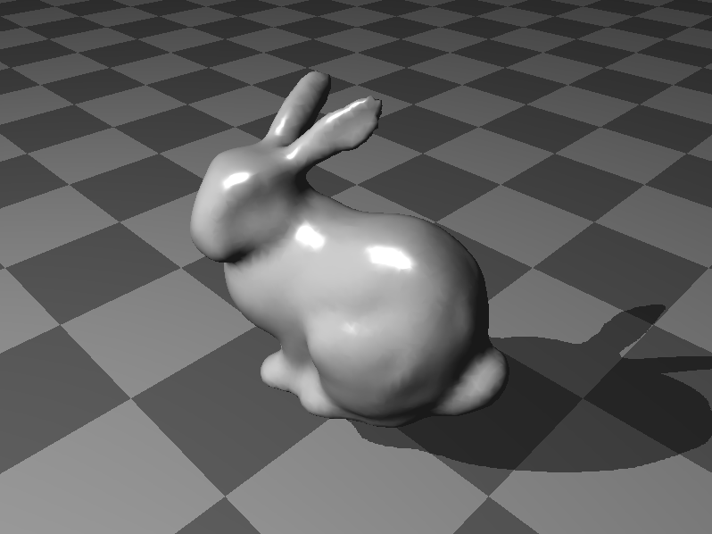

qt5-shadow-mapping
===

> Shadow mapping implementation with Qt5 and OpenGL (Qt 5.4 or higher)

## Build

Please use ```CMake 3.0.0``` or higher.

```shell
$ cmake .
$ cmake --build .
```

## Result



## License

MIT License 2015 (c) tatsy, Tatsuya Yatagawa
