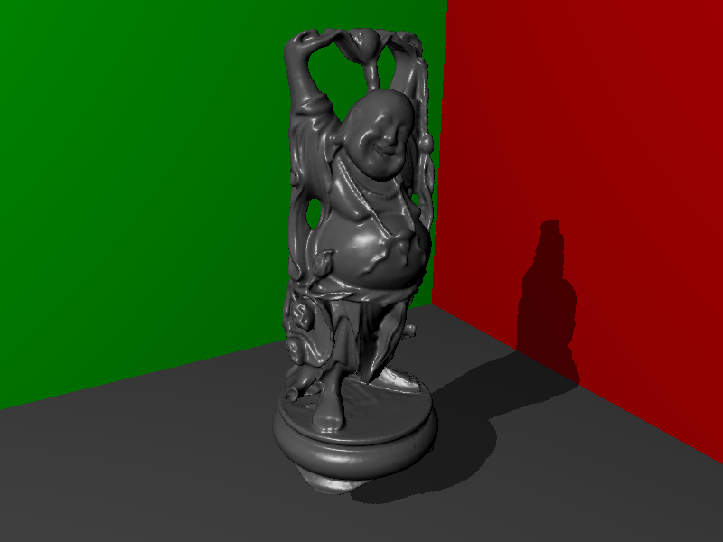
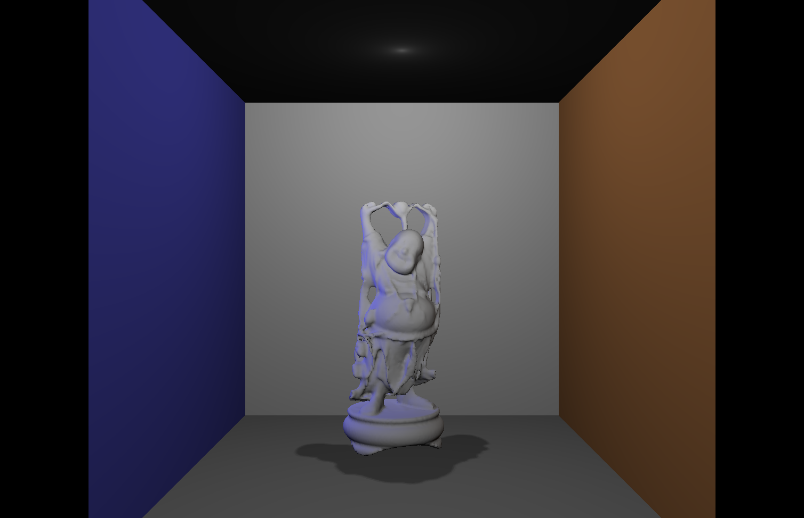

qt5-shadow-maps
===

[](./LICENSE)

> Shadow mapping implementation with Qt5 and OpenGL (Qt 5.4 or higher)

## Algorithms

* Ordinary shadow mapping for direct shadows
* Reflective Shadow Maps <a href="http://dl.acm.org/citation.cfm?id=1053460" target="_blank">[Dachsbacher and Stamminger 2005]</a>
* Imperfect Shadow Maps <a href="http://dl.acm.org/citation.cfm?id=1409082" target="_blank">[Ritschel et al. 2008]</a>

## Build

Please use ```CMake 3.0.0``` or higher.

```shell
$ git clone https://github.com/tatsy/qt5-shadow-maps.git
$ mkdir build
$ cd build
$ cmake ..
$ cmake --build .
```

## Result

| Shadow Maps                 | Reflective Shadow Maps    |
|-----------------------------|---------------------------|
|  |  |

| Imperfect Shadow Maps       | Shadow Maps from VPLs     |
|-----------------------------|---------------------------|
|  |  |


## License

MIT License 2015 (c) Tatsuya Yatagawa (tatsy)
